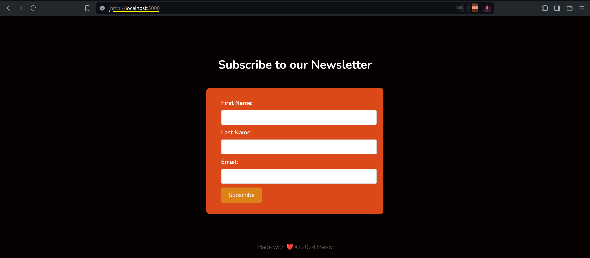

# Newsletter Platform with JavaScript, Flask, and MongoDB
This repository contains the code for the tutorial [Building a Newsletter Platform with JavaScript, Flask, and MongoDB](). This project showcases how to build a newsletter subscription platform using Flask for the backend, MongoDB for data storage, and JavaScript for dynamic user interactions.



## 🟢 Prerequisites

You must have:

- MongoDB installed on your machine. 
- Mongosh for interacting with your MongoDB instance. 
- RabbitMQ installed on your machine for message brokering. 
- An App password generated for Gmail.

This project was run and tested on a Linux machine with an Ubuntu 22.04LTS distribution.

## 📦 Getting Started
- Fork this repo to your GitHub account by clicking the Fork button.
- Clone the repo to your machine.

```command
git@github.com:<your-username>/newsletter-javascript-flask-mongodb.git
```

- Confirm the status of Mongod, your Rabbitmq-server and Mongosh.

```command
sudo systemctl status mongod
sudo systemctl status rabbitmq-server
mongosh 
```

- Populate the following fields in the `config.py` with your Gmail username, app password and email address.

- Run the flask application using the following command:

```command
flask --app app run
```

- Start the celery worker

```command
celery -A app.celery worker --loglevel=info
```
